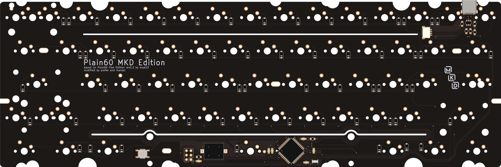
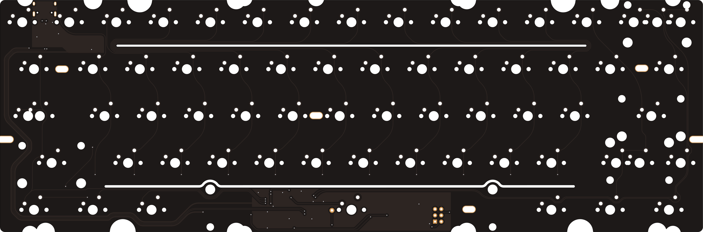
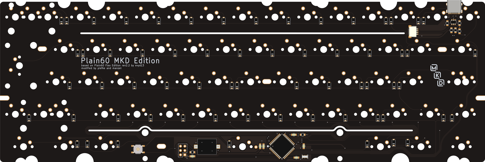
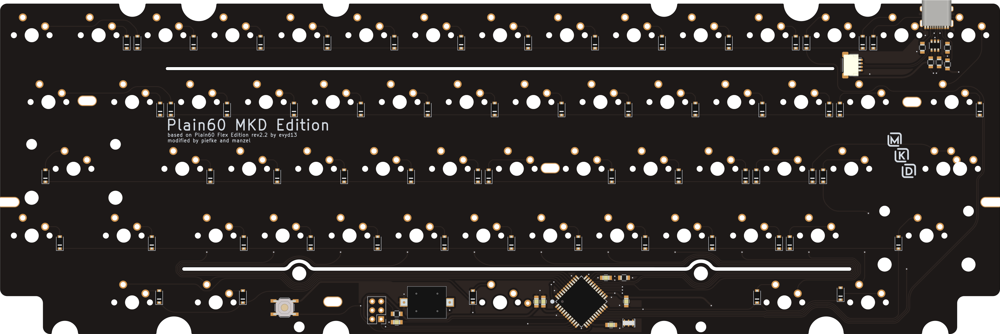
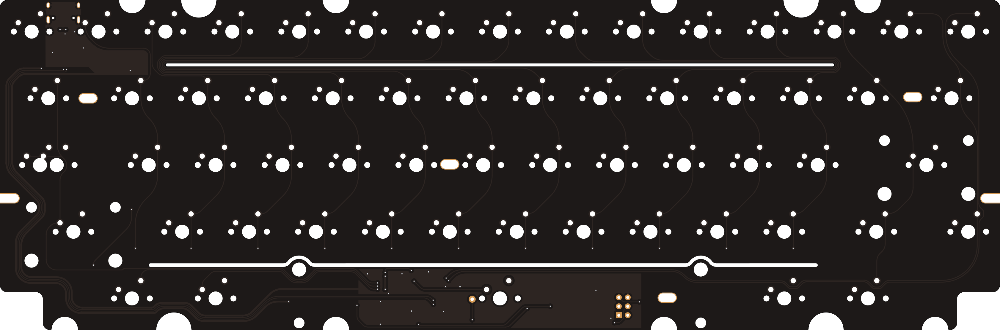

# Plain60 MKD Edition
This 60% PCB is a modified version of Plain60 Flex Edition rev2.2 by [evyd13](https://github.com/evyd13).

In the German keyboard community (MKD), we were looking for a universal (in the sense of board compatibility, not layout support) flexible PCB supporting all of our 60% boards. As this was not available, we used a Plain60 Flex Edition as basis, removed some holes (layout options, that is) we deemed unnecessary, and added some in other places (cutouts). The result of this is the Plain60 MKD Edition available here.

We went for even less layout support, making a tsangan (7u) bottom row the only choice. Additionally, support for ANSI and ISO is not included in a single PCB, but two variants. A third (HHKB) variant was specifically created to fit the Kara, which does not exhibit any layout options except for normal or stepped Caps Lock.

Other changes include the relocation of the microcontroller to below the spacebar, avoiding a stiffer spot on the left of the alpha cluster. The JST connector was moved as close to the position found on the Bakeneko PCB as possible, without changing the flex cut. For cases using a daughterboard, the PCB can be assembled without the USB connector. On the other hand, one can also omit the JST connector and use the USB-C one instead. Of course, assembling both is also possible, if your board has space for that.

This PCB is intended to be produced in 1.2 mm thickness and was only tested in this configuration. Depending on your choice of stabilizers, you may need shims (3D printed or FR4) for a *stable* fit. However, even though untested, 1.6 mm should work as well.

The files were created in KiCad 5.99 Nightly and later re-saved in 6 Stable, they will not open in KiCad 5.

## Features
 - USB-C and/or JST connector (for unified daughterboard)
 - ESD protection and fuse
 - Atmega32U4-AU
 - ISP header
 - AST1109MLTRQ speaker

## ANSI Version
In its ANSI version, the PCB supports only full left Shift and ANSI Enter. There are options for stepped or normal Caps Lock, full or split right Shift, and full or split Backspace.

## ISO Version
The ISO variant only supports split left Shift and ISO Enter. You can build with either stepped or normal Caps Lock, full or split right Shift, and full or split Backspace.

## HHKB Version
The HHKB version was made specifically for the Kara, but can of course be used in other HHKB-style compatible boards. It retains stepped or normal Caps Lock as the only layout option, while being fixed to HHKB layout otherwise.

## Production
Production files for JLCPCB (generated using the excellent [JLCKicadTools](https://github.com/matthewlai/JLCKicadTools)) are included. Part orientation in the CPL file was not checked as this seems to be automatically corrected by JLCPCB lately.

## Firmware
The needed QMK Firmware as well as VIA and Vial .hex and .json files are included in [firmware](./firmware/).